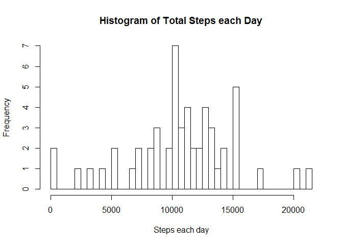
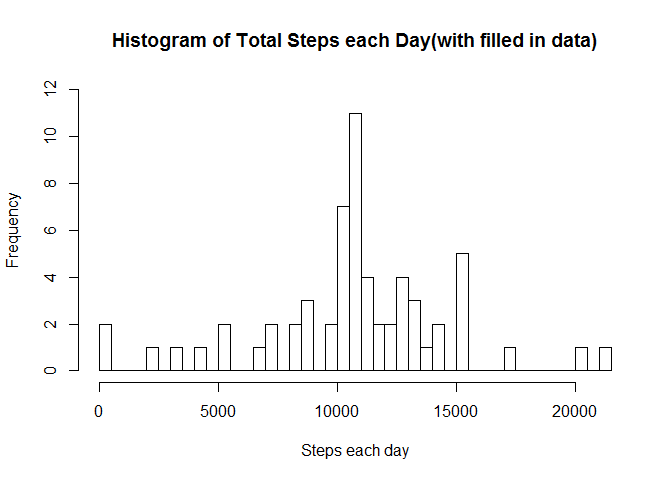
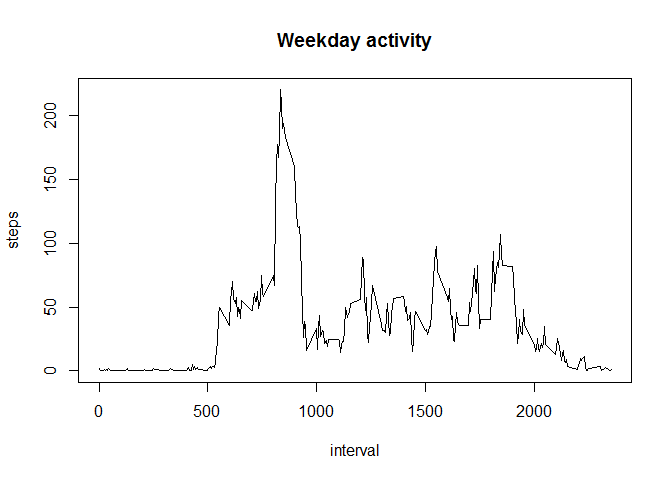
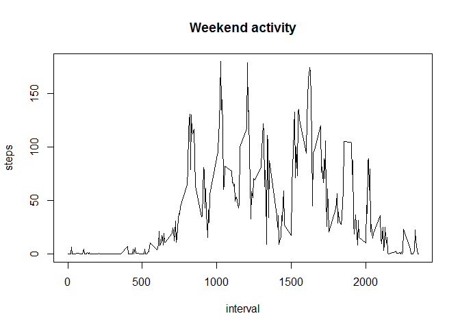

# Reproducible Research: Peer Assessment 1


## Loading and preprocessing the data

Load the data from activity.zip file:


```r
if(!file.exists("activity.csv")) {
  unzip("activity.zip")
}

activity <- read.csv("activity.csv")
```

## What is mean total number of steps taken per day?

1 Calculate the Total Steps per Day:

```r
total_steps <- aggregate(steps~date, data=activity, FUN=sum)
```

2 Histogram of total steps each day:

```r
max_steps <- max(total_steps$steps)
hist(total_steps$steps,
     xlab="Steps each day",
     breaks=seq(0,max_steps+500,by=500),
     main="Histogram of Total Steps each Day")
```

 

3 Find the Mean and Median of Steps each day:

```r
steps_mean <- mean(total_steps$steps)
steps_median <-median(total_steps$steps)
```
The Mean average of Steps each day is 10766.19 and the median is 10765.

## What is the average daily activity pattern?

1 Time series plot of he 5-minutes interval and (mean) average of steps:

```r
average_steps <- aggregate(steps~interval, data=activity, FUN=mean, rm.na=TRUE)

plot(steps~interval,average_steps,type="l")
```

 

2 Find the 5-minute interval with the maximum (mean) average

```r
max_average_steps <- max(average_steps$steps)
max_interval_loc <- which(average_steps$steps == max_average_steps)
```
The 5-minute interval with the maximum (mean) average is 835 with value of 206.17.
 
## Imputing missing values
1 The total number of missing values in the dataset:

```r
sum(!complete.cases(activity))
```

```
## [1] 2304
```

2 Fill any missing steps value with the the calculated average step for that interval rounded to nearest integer:

```r
fill.missing.steps <- function(i) {
  as.integer(round(average_steps$steps[which(average_steps$interval==i)]))
}
```

3 Fill in the missing step data using the above strategy:

```r
complete_activity <- activity

for( r in seq(nrow(activity))){
  if(is.na(activity$steps[r])) {
    complete_activity$steps[r] <-fill.missing.steps(activity$interval[r])
  }
}

sum(!complete.cases(complete_activity))
```

```
## [1] 0
```

4 Histogram of total steps each day when missing data is added:

```r
complete_total_steps <- aggregate(steps~date, data=complete_activity, FUN=sum)

complete_max_steps <- max(complete_total_steps$steps)
hist(complete_total_steps$steps,
     xlab="Steps each day",
     breaks=seq(0,complete_max_steps+500,by=500),
     ylim = c(0,12),
     main="Histogram of Total Steps each Day(with filled in data)")
```

 

```r
complete_steps_mean <- mean(complete_total_steps$steps)
complete_steps_median <-median(complete_total_steps$steps)
```
The averages of Steps each day in the Activity data with missing data added, is Mean=10765.64 and Median=10762.

By adding in the missing data with the chosen strategy, the Mean increased slightly from 10766.19 to 10765.64 and the Median reduced from 10765 to 10762. 

The Change that adding in missing data made to the Histogram, was to add 8 to the 10500 to 11000 step, giving the highest frequency.

## Are there differences in activity patterns between weekdays and weekends?

1 

```r
workday <- function(d) {
  day_of_week <- weekdays(as.Date(d))
  if (day_of_week == "Satuarday" || day_of_week == "Sunday" ) {
    return("weekend")
  } else {
    return("weekday")
  }
}
day <- as.factor(c("weekend","weekday"))

week_activity <- data.frame(complete_activity$steps, day,
                            complete_activity$interval)
colnames(week_activity)<- c("steps","day","interval")


for( r in seq(nrow(complete_activity))){
  week_activity$day[r] <- workday(complete_activity$date[r])
}
weekday_activity <- subset(week_activity, week_activity$day=="weekday")
weekend_activity <- subset(week_activity, week_activity$day=="weekend")

average_weekday <- aggregate(steps~interval, data=weekday_activity, FUN=mean)
average_weekend <- aggregate(steps~interval, data=weekend_activity, FUN=mean)

plot(steps~interval,average_weekday,type="l", main="Weekday activity")
```

 

```r
plot(steps~interval,average_weekend,type="l", main="Weekend activity")
```

 

